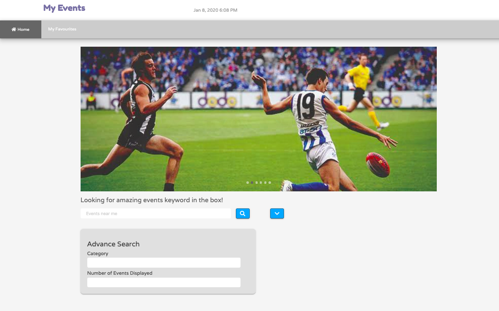
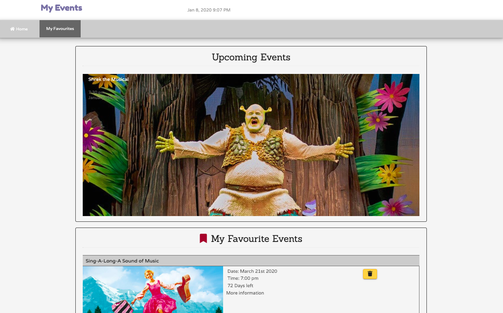

# Project 1

>Event searching and saving web application.

### Table of content

- [Description](##Description)
- [How to Use](##How-to-Use)
- [Technologies](##Technologies)
- [Directions for Future Development](##Directions-for-Future-Development)
- [Author Info](##Author-Info)

## Description

This two paged web application is used to aid user on searching for events they like, and track them as their favorite in favorite page.
It's designed in the concept of a small personal search engine for saving events and display the simplified information of the saved events. Also, this demo application can be considered as a starting point for a real company page as a third-party resource gathering engine.
This application is developed under the concept of responsive design.

[Back to the top](#Project-1)

## How to Use

Open index.html in the browser,
or open the URL of the deployed application with the following address in any browser: https://sherryj-sk.github.io/Project1/ (The page may require access for user geolocation).

In the search area, searching action can get 20 responses as default. Click "search" to search for events, and the results will be displayed below the search area. Click "arrow" beside the search button for more searching attributes, which include event "classification" and "response number". Also, the current time and date are displayed beside the brand name. The Carousel in this page only defaults images for presenting purpose only.

On every response, event image, start time and event name are displayed. Click Event Name can navigate to the event page. Users can also click the "star" symbol on each event to save them into the favorite page. Then users can click "favorite" in the navbar to go to favorite page.

In the favorite page, the Carousel is a display of local events functioning as a suggestion or tempting marketing advertisement. The events displayed in "My favorite event" area are events saved by the user into local storage. On each saved event, an image, event name, start time and days left until the current date is displayed, the user can click the delete button to delete the event from local storage.

The following files are used to create the application:
- index.html
- reset.css
- style01.css
- javaScript01.js
- moment.min.js

Other files contained in the History folder are out of date versions and demo for development purposes.

[Back to the top](#Project-1)

## Technologies
- HTML
- CSS
- Materialize 
- Bootstrap(for development only)
- Javascript
- JQuery
- Moment.js
- Ticketmaster API

[Back to the top](#Project-1)

## Directions for Future Development

Another event API can be added into search results as user click searches, such as Meetup and Eventbrite or event Facebook, due to the time limit we used only one. Sorting function can be added into favorite page according to time left, alphabet or event type. 

The other functions can be added are more searching attribute, "more result" button when the user reaches the end of the current search result, and a better coloring of this webpage.

There are still small problems need to be adjusted to fit user habit, but time is our biggest enemy.

[Back to the top](#Project-1)

## Author Info

The design is accomplished by following developers from the same Web Dev Bootcamp of USYD.

- Dhani - [Github](https://pozengineer.github.io/)
- Sherry - [Github]()
- Ye Yuan - [Github](https://github.com/AndyYuan-Oni)

[Back to the top](#Project-1)
